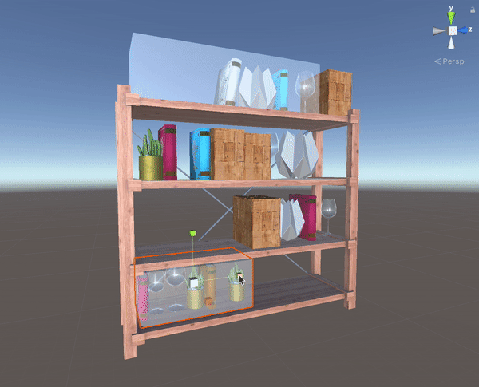

# objectplacer
Unity script that fills the proxy space with cloned object

This script will make clone of selected object, and fill the space that is based on proxy object in runtime.
In the playmode, hit the Space key to make clones. 
After the second time, script will replace previsous clones with new clones.

